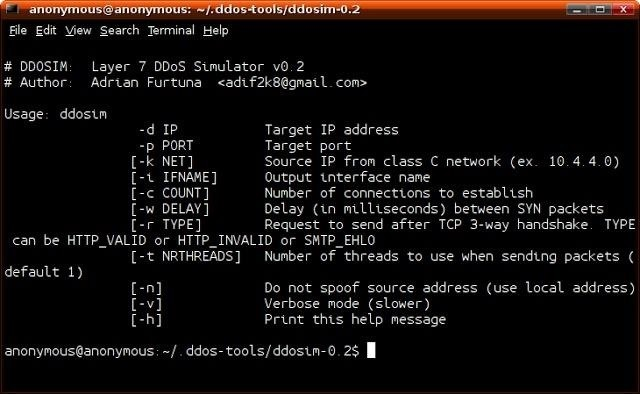
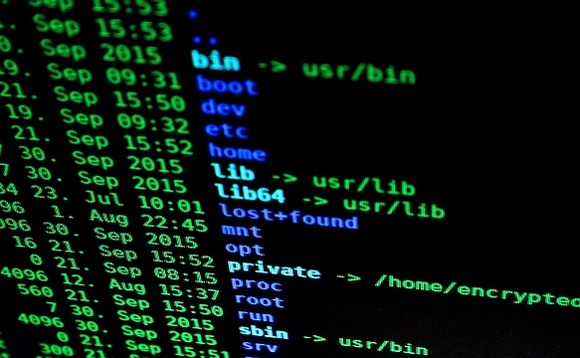

# DDOS-attack


# WLCOME TO TOOLS PRQUINO
### ----------------------------------------------------------------------------------------------------------------------------------------





### APA ITU DDOS
Serangan DoS adalah jenis serangan terhadap sebuah komputer atau server di dalam jaringan internet dengan cara menghabiskan sumber yang dimiliki oleh komputer tersebut sampai komputer tersebut tidak
Distributed Denial of Service atau lebih dikenal dengan nama DDoS adalah sebuah percobaan penyerangan dari beberapa sistem komputer yang menargetkan sebuah server agar jumlah traffic menjadi terlalu tinggi sampai server tidak bisa menghandle requestnya.

DDoS biasa dilakukan dengan menggunakan beberapa sistem komputer yang digunakan sebagai sumber serangan. Jadi mereka melakukan serangan ke satu server melalui beberapa komputer agar jumlah traffic juga bisa lebih tinggi. Serangan DDoS bisa dibilang seperti kemacetan lalu lintas yang menghalangi pengemudi untuk mencapai tujuan yang diinginkan dengan tepat waktu.



Lalu bagaimana sebenarnya cara kerja serangan DDoS ini?

Untuk melakukan DDoS attack, penyerang memerlukan kontrol ke jaringan sebuah mesin online. Ini bisa berupa komputer atau device Internet of Things lainnya yang memiliki malware. Ini dilakukan agar setiap komputer atau device ini menjadi bot atau zombie. Kumpulan dari bot atau zombie ini disebut dengan istilah botnet.

Setelah botnet berhasil dibuat, penyerang juga bisa mengatur mesin-mesin ini dengan mengirimkan instruksi ke setiap bot melalui metode remote control. Setelah botnet menargetkan IP Address korban, setiap bot akan mengirimkan request ke target sampai server target tidak bisa menghandle requestnya. Ini akan mengakibatkan denial of service atau penolakan layanan ke traffic normal. Karena setiap bot yang digunakan adalah device internet yang masuk akal, memisahkan mana yang traffic biasa dan mana yang traffic serangan memang tidak mudah.

Jenis-Jenis DDOS Attack
DDoS attack sendiri terdiri dari beberapa jenis. Berikut ini adalah beberapa jenis serangan DDoS yang paling sering terjadi:

UDP Flood

UDP atau User Diagram Protocol adalah jaringan protocol tanpa session, yang membanjiri port sebuah remote host secara acak. Dengan begitu, host server perlu melakukan pemeriksaan di port-port ini dan me-report balik dengan menggunakan paket ICMP. Proses ini sebenarnya akan menghancurkan resource milik host dan menyebabkan website tidak bisa diakses.

ICMP (Ping) Flood

Pada serangan ICMP flood, resource target akan dibanjiri dengan request ICMP secara cepat tanpa menunggu respon dari Anda. Jenis serangan seperti ini semua bandwidth masuk maupun keluar terkena dampaknya dan ini mengakibatkan kelambatan sistem pada server milik korban. 

SYN Flood

Pada serangan SYN flood, pesan sinkronisasi (SYN) diterima di mesin host untuk memulai dengan “jabat tangan”. Permintaan ini diakui oleh server dengan mengirimkan tanda pengesahan (ACK) ke host awal dan menunggu koneksi ditutup. Koneksi akan selesai ketika mesin yang meminta akan menutup koneksi. Dalam serangan SYN flood, permintaan palsu dikirim dan server merespon dengan paket ACK untuk menyelesaikan koneksi TCP tetapi sambungan diarahkan kee timeout, daripada menutupnya. Oleh karena itu, sumber daya server menjadi lelah dan server pun akhirnya offline.

Dewaweb cashback 30%
Ping of Death

Serangan ping of death (“POD”) adalah serangan dimana penyerang mengirimkan beberapa ping yang salah atau berbahaya ke komputer. Panjang paket maksimum dari paket IP (termasuk header) adalah 65.535 byte. Namun, Layer Data Link biasanya menimbulkan batasan untuk ukuran frame maksimum – misalnya 1500 byte melalui jaringan Ethernet. Dalam hal ini, paket IP yang besar dibagi di beberapa paket IP (dikenal sebagai fragmen), dan host penerima merakit kembali fragmen IP ke dalam paket lengkap. Dalam skenario Ping of Death, setelah manipulasi berbahaya dari konten fragmen, penerima berakhir dengan paket IP yang lebih besar dari 65.535 byte ketika dipasang kembali. Ini dapat membanjiri buffer memori yang dialokasikan untuk paket, menyebabkan penolakan layanan untuk paket yang sah.

Baca Juga: OWASP: Standard Keamanan Web App Dunia

Itulah beberapa jenis serangan DDoS yang sering terjadi. Nah, sekarang bagaimana caranya agar Anda tidak terkena DDoS attack? Yuk lanjut baca artikel ini.

Lindungi Website dan Server Anda dari DDoS Attack
Web app Anda terdiri dari beberapa layers dan untuk melindungi diri dari berbagai DDoS Attack, Anda perlu memastikan bahwa tujuh layer web app Anda sudah terlindungi. Untuk melindungi website dari serangan ini, Anda bisa menggunakan beberapa layanan yang memang disediakan dengan tujuan untuk melindungi website Anda.

Cloudflare

Cloudflare adalah salah satu layanan keamanan website yang paling popular. Bahkan jika Anda menggunakan versi gratisnya, Anda tetap akan terlindungi dari DDoS. Jika Anda memerlukan perlindungan yang lebih tinggi, mungkin Anda memerlukan akun bisnis. Untuk menggunakan Cloudflare, Anda hanya perlu membayar tiap bulan dan biayanya selalu sama; tidak peduli berapa banyak serangan yang mereka hadapi atau seberapa kuat serangannya. Jaringan Cloudflare sudah tersebar ke lebih dari 102 data centers dan bisa menghandle lebih dari 10 TBps serta menghadapi serangan apapun. Cloudflare juga menyediakan layanan emergency 24 jam yang bisa Anda gunakan saat sedang terjadi serangan. Kalau ada dari Anda yang ingin tahu lebih banyak tentang Cloudflare, Anda bisa membaca Panduan Dasar Cloudflare dari kami.

Dewaguard

Dewaguard adalah tool anti malware berkualitas tinggi dari Dewaweb. Dengan Dewaguard, website Anda akan terlindungi. Mulai dari WordPress sampai Magento, Dewaguard bisa melindungi semuanya. Perlindungan dari DDoS sudah disertakan di paket antivirus dan firewall. Dewaguard sendiri bisa menghilangkan malware yang menginfeksi website Anda dan memberi notifikasi kepada webmaster jika ada potensi ancaman. Selain itu, Dewaguards juga melakukan backup secara rutin dan otomatis jadi Anda tidak perlu khawatir soal data yang hilang. Jika Anda ingin informasi lebih lanjut, Anda bisa mengunjungi halaman produk Dewaguard.

Akamai

Akamai adalah salah satu pemimpin di bidang cybersecurity dan CDN. Berdasarkan administrasi Akamai, layanan ini bisa mengatasi sampai dengan serangan 1.3 TBps. Serangan terbesar yang pernah mereka atasi adalah 620 Gbps dan mereka berhasil mengatasinya dengan cepat. Akamai memiliki layanan perlindungan DDoS yang disebut Kona DDoS Defender yang memang dibangun di platform intelijen Akamai. Selain itu, mereka juga menyediakan support 24/7. Layanan ini bisa menghentikan serangan sebelum serangannya mencapai web applications. Perlindungan DDoS Akamai terdiri dari sekitar 1300 node jaringan yang terletak di lebih dari 100 negara di seluruh dunia.

Simpulan

Dengan semakin berkembangnya dunia online, begitu juga dengan ancaman-ancaman yang ada di dunia online. DDoS hanyalah satu dari sekian banyak ancaman yang ada di dunia online. Kalau Anda ingin tahu lebih banyak tentang keamanan sibernetika di Indonesia, Anda bisa mendownload eBook kami Cyber Security: Issue and Guide 2018. Semoga membantu ya!

# Cara Mengatasi Serangan DDoS


Melakukan Identifikasi Serangan, serangan akan terlihat tanda-tandanya jika mengecek server. Apabila sudah diketahui, alangkah baiknya mempersiapkan penangannya sebelum terjadi serangan yang lebih serius. Seperti kasus berikut:
Syn Flooding, gunakan firewal untuk tidak meneruskan paket data yang tidak diketahui dengan jelas asalnya.
Remote Controled Attack, block alamat IP dan portnya.
UDP Flooding, Menolak paket trafik yang datang dari luar jaringan dan mematikan semua layanan UDP.
Smurf Attack, disable broadcast address pada router atau filtering permintaan ICMP echo request pada firewall atau juga membatasi trafik ICMP.
Mempertahankan Parameter Network, salah satunya dengan memperbesar bandwith. Cara ini hanya memberikan waktu supaya sistem tidak down, tetapi cara ini kurang ampuh terhada serangan yang besar.
Menghubungi Hosting Provider atau ISP, mereka dapat melacak serangan yang terjadi melalui alamat ip di sistem.
Menghubungi Spesialis DDoS, jika cara diatas tidak berhasil. Bisa dengan menghubungi spesialis yang akan membantu untuk menangani serangan yang terjadi.
# how to install
### DDOS-attack
```bash
* $ apt update & upgrade
* $ apt install git
* $ apt install python
* $ apt install python2
* $ apt install nano
* $ git clone https://github.com/Cyber-PRQUINO-HAK/DDOS-attack
```
# TERIMAKASIH
[https://github.com/Cyber-PRQUINO-HAK/DDOS-attack](#https://github.com/Cyber-PRQUINO-HAK/DDOS-attack)

